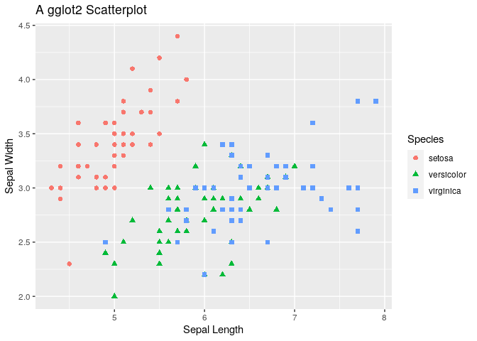

# A comparison of data visualisation on Python and R


```r
library(ggplot2)

scatter <- ggplot(data=iris, aes(x = Sepal.Length, y = Sepal.Width)) 
scatter + geom_point(aes(color=Species, shape=Species), size=2) +
  xlab("Sepal Length") +  ylab("Sepal Width") +
  ggtitle("A gglot2 Scatterplot")
```

<!-- -->


```python
import pandas as pd
import seaborn as sns
import matplotlib.pyplot as plt

iris_pd = r.iris

ax = sns.scatterplot(x='Sepal.Length', y='Sepal.Width', data=iris_pd, hue="Species", style="Species")
ax.set_title("A Seaborn Scatterplot")
```


